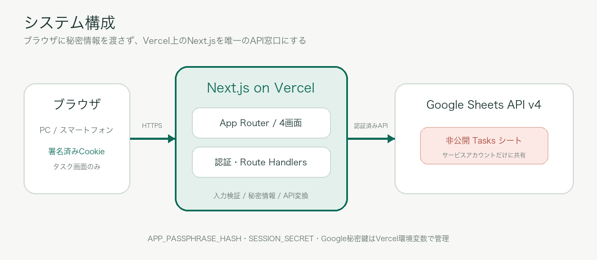

# 技術要件書

## わたしのタスク管理

**文書バージョン:** 0.1（実装方針版）  
**作成日:** 2026年7月27日  
**ステータス:** Draft／実装着手前  
**関連文書:** 要件定義書 v0.1

> Next.js App Routerを中心に、Vercel上のサーバー処理を経由して非公開のGoogle Sheetsを操作する。秘密情報をブラウザへ渡さず、個人利用に適した小さく保守しやすい構成とする。

---

## 1. 文書の目的

本書は「わたしのタスク管理」を実装、テスト、デプロイ、運用するための技術要件を定義する。機能・画面・受け入れ条件は別紙「要件定義書」を正とする。

## 2. 技術方針

### 2.1 基本原則

- 標準的なNext.js構成を優先し、個人アプリに不要なサービスを増やさない。
- ブラウザからGoogle Sheets APIを直接呼び出さない。
- Google Sheetsを永続データの正本とする。
- 優先度は緊急度と重要度から導出し、矛盾する状態を作らない。
- 認証セッションはサーバーで署名したCookieに保存し、別の認証データベースを持たない。
- すべての秘密情報はVercelの環境変数で管理する。

### 2.2 推奨技術スタック

| 分類 | 採用技術 | 方針 |
|---|---|---|
| フレームワーク | Next.js 16.x | App Router、Route Handlersを利用 |
| UI | React 19.x | Server Componentを既定、操作部分のみClient Component |
| 言語 | TypeScript 5.x | `strict: true` |
| スタイル | Tailwind CSS 4.x + CSS Variables | 色・余白・角丸をデザイントークン化 |
| 実行環境 | Vercel Node.js Runtime | Google認証ライブラリとの互換性を優先 |
| データ | Google Sheets API v4 | 非公開スプレッドシートをサービスアカウントで操作 |
| 入力検証 | Zod相当のスキーマ検証 | API境界と環境変数を検証 |
| 単体テスト | Vitest相当 | ビジネスロジックを対象 |
| UIテスト | React Testing Library相当 | 入力・状態・アクセシビリティを対象 |
| E2E | Playwright相当 | 認証から完了までの主要導線 |

各パッケージの正確なパッチバージョンは実装開始時点の安定版を採用し、lockfileで固定する。Next.jsは16.2系を基準とする。

## 3. システム構成



### 3.1 処理経路

1. ブラウザがVercel上のNext.jsアプリへアクセスする。
2. Next.jsが署名済みセッションCookieを確認する。
3. 認証済みブラウザだけがタスク用Route Handlerを呼び出す。
4. Route Handlerが入力値を検証し、Google Sheets APIクライアントを呼び出す。
5. Google Sheets APIが非公開スプレッドシートを読み書きする。
6. APIは画面表示用のJSONへ正規化して返す。

### 3.2 ディレクトリ構成案

```text
app/
  (auth)/
    login/page.tsx
  (app)/
    layout.tsx
    page.tsx
    all/page.tsx
    due/page.tsx
    matrix/page.tsx
  api/
    auth/login/route.ts
    auth/logout/route.ts
    tasks/route.ts
    tasks/[id]/route.ts
lib/
  auth/
    password.ts
    session.ts
  sheets/
    client.ts
    repository.ts
    mapper.ts
  tasks/
    priority.ts
    sort.ts
    schema.ts
  date/
    tokyo.ts
components/
  task/
  navigation/
  feedback/
types/
tests/
```

画面ルートは要件上の4画面に対応させる。ルートパスは実装時に短縮してもよいが、意味が分かる命名とする。

## 4. Next.js要件

### 4.1 App Router

- App Routerを利用する。
- ページとレイアウトはServer Componentを既定とする。
- フォーム、ドラッグ＆ドロップ、並べ替えなどブラウザ状態が必要な箇所のみClient Componentとする。
- JSON APIは`app/api/**/route.ts`のRoute Handlersで実装する。
- 認証Cookieの読み書きにはサーバー側の`cookies()` APIを利用する。

### 4.2 レンダリングとキャッシュ

- 個人タスクデータを返すページおよびAPIは動的処理とする。
- タスク一覧APIは`Cache-Control: no-store`を基本とする。
- ブラウザ内では直近の取得結果を保持し、画面切り替えごとの不要な再取得を避ける。
- 登録・更新・完了・復元・削除後は、クライアント状態を更新してから必要な再検証を行う。
- サーバーキャッシュへ個人タスクを共有保存しない。

### 4.3 実行ランタイム

- Google認証ライブラリとNode.js暗号APIを使用するため、タスクAPIと認証APIはNode.js Runtimeを使用する。
- Edge Runtime固有の制約へ依存しない。
- API処理は短時間で完了させ、長時間ジョブを作らない。

## 5. 認証・セッション要件

### 5.1 認証方式

- ユーザー名は持たず、1つのパスフレーズだけを検証する。
- パスフレーズの平文はリポジトリやブラウザに保存しない。
- Vercel環境変数には、ソルト付きハッシュを保存する。
- サーバーでパスフレーズをハッシュ化し、定数時間比較を行う。

### 5.2 セッション

- 認証成功時に有効期限90日の署名済みセッショントークンを発行する。
- Cookie名の例は`task_session`とする。
- Cookie属性は`HttpOnly`、`Secure`、`SameSite=Lax`、`Path=/`、`Max-Age=90日`を必須とする。
- セッションには利用者情報を保存せず、発行日時、有効期限、トークン種別のみを含める。
- ログアウト時はCookieを失効させる。
- `SESSION_SECRET`の変更で全セッションを一括失効できる。

### 5.3 認可

- 4画面とすべてのタスクAPIでセッション検証を行う。
- 画面側の表示制御だけに依存せず、各Route Handlerで認証を再確認する。
- 未認証API応答は`401 Unauthorized`とする。
- Cookieを使う更新系リクエストでは、`Origin`または`Sec-Fetch-Site`を検査し、意図しないクロスサイト送信を拒否する。

### 5.4 総当たり対策

MVPでは外部のレート制限用データストアを追加しない。代わりに次を必須とする。

- 十分に長いパスフレーズを使用する。
- 認証失敗理由を区別して返さない。
- 失敗応答に小さな固定遅延を設ける。
- 異常な連続失敗が確認された場合は、Vercel側のアクセス制御追加を検討する。

## 6. Google Sheets連携

### 6.1 認証方式

- Google Cloudで専用サービスアカウントを作成する。
- 対象スプレッドシートだけをサービスアカウントのメールアドレスへ編集者として共有する。
- スプレッドシート自体は一般公開しない。
- Google Sheets API v4を有効化する。
- サーバー間認証はGoogle公式クライアントライブラリを利用し、JWT署名処理を独自実装しない。

### 6.2 スプレッドシート構造

シート名は`Tasks`を既定とし、1行目をヘッダーとして固定・保護する。

| 列 | キー | 型・形式 | 説明 |
|---:|---|---|---|
| A | id | UUID文字列 | タスク一意ID |
| B | title | 文字列 | 1〜200文字 |
| C | due_date | YYYY-MM-DD | 日本時間基準、時刻なし |
| D | is_urgent | TRUE/FALSE | 緊急度 |
| E | is_important | TRUE/FALSE | 重要度 |
| F | priority | P1〜P4 | D・Eから算出した表示値 |
| G | status | todo/done | 完了状態 |
| H | completed_at | ISO 8601または空 | 完了日時 |
| I | is_deleted | TRUE/FALSE | 論理削除 |
| J | created_at | ISO 8601 | 作成日時 |
| K | updated_at | ISO 8601 | 更新日時 |
| L | version | 正の整数 | 競合検知用 |

`priority`はスプレッドシート上の可読性のため保存するが、APIでは`is_urgent`と`is_important`から必ず再計算して書き込む。入力された任意のpriority値は信用しない。

### 6.3 読み書き方針

- 一覧取得は`spreadsheets.values.get`または`batchGet`で必要範囲をまとめて取得する。
- 新規追加は`spreadsheets.values.append`を使用する。
- 更新、完了、復元、削除はIDから対象行を特定し、対象行の値を`update`または`batchUpdate`で更新する。
- 複数セルを更新する処理は、可能な限り1回のAPIリクエストにまとめる。
- 物理的な行削除は行わず、`is_deleted`を更新する。
- 空の末尾行や手動入力された不正な行は、変換層で検知して安全に無視またはエラー報告する。

### 6.4 同時更新

利用者は1名だが、PCとスマートフォンから同時利用する可能性がある。

- 更新要求には現在の`version`を含める。
- サーバー上の`version`と一致しない場合は`409 Conflict`を返す。
- 更新成功時に`version + 1`と`updated_at`を同時に書き込む。
- 競合時は最新データを再取得し、画面で再編集を促す。

Google Sheetsは汎用データベースではないため、厳密な高並行トランザクションは保証対象外とする。個人利用の同時更新防止として上記の楽観的競合検知を採用する。

### 6.5 API使用量

- 初回表示で全タスクを1回取得し、4画面の集計・絞り込みはクライアントまたはサーバーの共通ロジックで行う。
- 常時ポーリングは行わない。
- 再取得はログイン直後、更新成功後、手動更新、または一定時間後の再フォーカス時に限定する。
- `429`には上限付き指数バックオフを使用する。
- 更新系操作は、重複実行を避けるため無条件に自動再試行しない。

## 7. ドメインモデル

```ts
type TaskStatus = "todo" | "done";
type Priority = "P1" | "P2" | "P3" | "P4";

type Task = {
  id: string;
  title: string;
  dueDate: string;       // YYYY-MM-DD
  isUrgent: boolean;
  isImportant: boolean;
  priority: Priority;    // server-calculated
  status: TaskStatus;
  completedAt: string | null;
  isDeleted: boolean;
  createdAt: string;
  updatedAt: string;
  version: number;
};
```

### 7.1 優先度算出

```text
urgent=true,  important=true  -> P1
urgent=false, important=true  -> P2
urgent=true,  important=false -> P3
urgent=false, important=false -> P4
```

優先度算出関数は副作用のない純粋関数として実装し、単体テストで全4パターンを保証する。

### 7.2 日付処理

- `dueDate`は日付文字列として保存し、UTC日時へ変換して比較しない。
- 「今日」は`Asia/Tokyo`のカレンダー日付として生成する。
- 完了・作成・更新日時はISO 8601 UTCで保存し、画面表示時に日本時間へ変換する。
- 今週は日本時間の月曜日00:00から日曜日23:59相当のカレンダー範囲とする。

## 8. API要件

### 8.1 エンドポイント

| Method | Path | 用途 |
|---|---|---|
| POST | `/api/auth/login` | パスフレーズ検証、Cookie発行 |
| POST | `/api/auth/logout` | Cookie削除 |
| GET | `/api/tasks` | タスク一覧取得 |
| POST | `/api/tasks` | タスク追加 |
| GET | `/api/tasks/:id` | タスク詳細取得 |
| PATCH | `/api/tasks/:id` | 編集、完了、復元、象限移動 |
| DELETE | `/api/tasks/:id` | 論理削除 |

`PATCH`は変更対象フィールドだけを受け取り、許可されていないフィールドを拒否する。

### 8.2 共通レスポンス

成功例:

```json
{
  "data": {},
  "meta": {
    "requestId": "uuid"
  }
}
```

失敗例:

```json
{
  "error": {
    "code": "VALIDATION_ERROR",
    "message": "入力内容を確認してください"
  },
  "meta": {
    "requestId": "uuid"
  }
}
```

### 8.3 ステータスコード

| Code | 用途 |
|---:|---|
| 200 | 取得・更新成功 |
| 201 | 新規作成成功 |
| 204 | ログアウト等、本文なし成功 |
| 400 | 入力形式不正 |
| 401 | 未認証またはセッション期限切れ |
| 404 | 対象タスクなし |
| 409 | 更新競合または重複ID |
| 429 | API使用量超過 |
| 500 | アプリ内部エラー |
| 502 | Google Sheets API接続・応答エラー |

## 9. フロントエンド要件

### 9.1 状態管理

- サーバーデータと一時的なUI状態を分離する。
- MVPでは大規模なグローバル状態管理ライブラリを導入しない。
- 一覧データは共通Providerまたは小さなデータ取得フックで共有する。
- フォーム編集中の値、モーダル、並べ替え条件はローカル状態とする。
- 楽観的表示を行う場合も、失敗時に元へ戻せることを必須とする。

### 9.2 マトリクス操作

- デスクトップのグリッドは、右上=P1、右下=P2、左上=P3、左下=P4の配置とする。
- 重要度の軸は左から右、緊急度の軸は下から上へ高くなる。
- ポインター、タッチ、キーボードに対応できるドラッグ＆ドロップ手段を採用する。
- ドラッグ操作が利用できない場合に、メニューから移動先を選べる。
- 移動開始、移動先、完了を視覚的かつ支援技術へ通知する。
- 保存失敗時は元の象限へ戻し、エラーを表示する。

### 9.3 アクセシビリティ

- セマンティックHTMLを利用する。
- すべての入力にラベルを設定する。
- フォーカス表示を消さない。
- コントラストはWCAG 2.2 AA相当を目標とする。
- 色と位置だけに依存せず、優先度ラベルを併記する。
- 通知には`aria-live`を利用する。
- モーダルではフォーカストラップと閉じた後のフォーカス復帰を行う。

### 9.4 レスポンシブ

- 360px程度のスマートフォン幅からデスクトップまで対応する。
- スマートフォンでは下部ナビゲーションを基本とする。
- マトリクスはスマートフォンでも4象限の関係を維持する。文字が読めない場合は縦方向の象限カードへ切り替える。
- タップ対象は十分な大きさを確保する。

## 10. 環境変数

| 変数名 | 秘密 | 用途 |
|---|---:|---|
| `APP_PASSPHRASE_HASH` | はい | パスフレーズのソルト付きハッシュ |
| `SESSION_SECRET` | はい | セッショントークン署名鍵。32バイト以上 |
| `GOOGLE_SERVICE_ACCOUNT_EMAIL` | はい | サービスアカウント |
| `GOOGLE_PRIVATE_KEY` | はい | サービスアカウント秘密鍵 |
| `GOOGLE_SHEET_ID` | はい | 対象スプレッドシートID |
| `GOOGLE_SHEET_TAB` | いいえ | 既定値`Tasks` |
| `APP_TIME_ZONE` | いいえ | 既定値`Asia/Tokyo` |
| `NEXT_PUBLIC_APP_NAME` | いいえ | 画面表示用アプリ名 |

- 秘密値に`NEXT_PUBLIC_`を付けない。
- `.env.local`をGitへコミットしない。
- Production、Preview、Developmentで環境変数を分離する。
- 環境変数変更後は再デプロイして反映する。
- 秘密鍵に含まれる改行を正しく復元できる実装とする。

## 11. セキュリティ要件

- 依存パッケージの脆弱性を定期確認する。
- API入力をスキーマ検証し、想定外のプロパティを拒否する。
- タスク名をHTMLとして解釈しない。
- セキュリティヘッダーとして、CSP、`X-Content-Type-Options: nosniff`、`Referrer-Policy`、`frame-ancestors`相当を設定する。
- 認証応答、タスクAPI、HTMLに`no-store`を適用する。
- Google秘密鍵をクライアントコード、ログ、エラー本文へ含めない。
- Vercel Preview環境にも本番のGoogle Sheets資格情報を不用意に渡さない。
- Previewではテスト用スプレッドシートを使用する。

## 12. エラー処理とログ

### 12.1 利用者向け

- エラーは「何が保存されなかったか」「次に何をすべきか」を日本語で表示する。
- Google APIの生メッセージやスタックトレースを表示しない。
- 入力エラーは対象フィールドの近くに表示する。
- セッション切れ時は入力内容を可能な範囲で保持して再認証へ誘導する。

### 12.2 サーバーログ

記録対象:

- requestId
- API操作種別
- HTTPステータス
- 処理時間
- Google APIの分類済みエラーコード

記録禁止:

- パスフレーズ
- セッションCookie
- Google秘密鍵
- タスク名
- スプレッドシートのセル内容

## 13. テスト要件

### 13.1 単体テスト

- P1〜P4の算出4パターン
- 日本時間の今日、期限切れ、本日期限、今週判定
- ダッシュボードの優先順位
- スプレッドシート行とTask型の相互変換
- 入力検証
- セッション有効期限と署名検証

### 13.2 結合テスト

- Google Sheets APIクライアントをモックしたRoute Handler
- 認証済み／未認証API
- タスク追加、更新、完了、復元、削除
- `version`不一致による409
- 429、Google API障害時の変換

### 13.3 E2Eテスト

1. パスフレーズでログインする。
2. 必須項目を入力してタスクを追加する。
3. TODO ALLと今日までの表示を確認する。
4. マトリクス上で象限を移動する。
5. タスクを完了する。
6. 完了済み表示から未完了へ戻す。
7. ログアウトし、保護画面へ戻ることを確認する。

PC相当とスマートフォン相当の2種類の表示幅で主要導線を確認する。

## 14. CI/CD・デプロイ要件

- GitリポジトリをVercelへ接続する。
- Pull Requestまたは作業ブランチごとにPreview Deploymentを作成する。
- 本番ブランチへの反映でProduction Deploymentを行う。
- CIで型チェック、Lint、単体テスト、ビルドを実行する。
- Previewはテスト用スプレッドシート、本番は本番用スプレッドシートへ接続する。
- Vercel Hobbyプランを前提とするが、利用量や規約変更時は再確認する。
- HTTPSはVercelの標準機能を利用する。

## 15. 運用要件

- 月1回程度、Google Sheetsを複製またはエクスポートしてバックアップする。
- ヘッダー行と列順を手動変更しない。
- パスフレーズ変更時は`APP_PASSPHRASE_HASH`を更新して再デプロイする。
- セッションを全失効する場合は`SESSION_SECRET`を更新する。
- Googleサービスアカウント鍵は不要になった時点で無効化・削除する。
- 障害時はVercelログのrequestIdとGoogle APIステータスを確認する。

## 16. 実装順序

1. Next.jsプロジェクトとデザイントークンを準備
2. Task型、優先度、日付、並べ替えロジックを実装
3. Google Sheetsテスト環境とRepository層を実装
4. パスフレーズ認証とセッションを実装
5. タスクAPIを実装
6. ダッシュボード、TODO ALL、今日までを実装
7. マトリクスと代替操作を実装
8. 完了履歴、復元、論理削除を実装
9. 自動テスト、アクセシビリティ、レスポンシブ確認
10. Vercel Preview検証後、本番デプロイ

## 17. 技術的な受け入れ条件

- [ ] Next.js App Routerで4画面と認証画面が構成されている。
- [ ] TypeScript strict設定で型エラーがない。
- [ ] 秘密情報がクライアントバンドルへ含まれない。
- [ ] 未認証状態で全タスクAPIが401を返す。
- [ ] Google Sheetsが一般公開されていない。
- [ ] タスク追加・更新が1操作あたり必要最小限のSheets API呼び出しで完了する。
- [ ] 日付判定がAsia/Tokyoでテストされている。
- [ ] 主要E2EシナリオがPC・スマートフォン幅で通る。
- [ ] ProductionとPreviewで異なるスプレッドシートを利用する。
- [ ] Vercel本番環境でビルド・起動・主要操作が成功する。

## 18. 参考資料

1. [Next.js — Route Handlers](https://nextjs.org/docs/app/api-reference/file-conventions/route)
2. [Next.js — Authentication Guide](https://nextjs.org/docs/app/guides/authentication)
3. [Next.js — Environment Variables](https://nextjs.org/docs/app/guides/environment-variables)
4. [Vercel — Environment Variables](https://vercel.com/docs/environment-variables)
5. [Vercel — Account Plans](https://vercel.com/docs/plans)
6. [Google — OAuth 2.0 for Server to Server Applications](https://developers.google.com/identity/protocols/oauth2/service-account)
7. [Google Sheets API — Read & Write Cell Values](https://developers.google.com/workspace/sheets/api/guides/values)
8. [Google Sheets API — Usage Limits](https://developers.google.com/workspace/sheets/api/limits)
