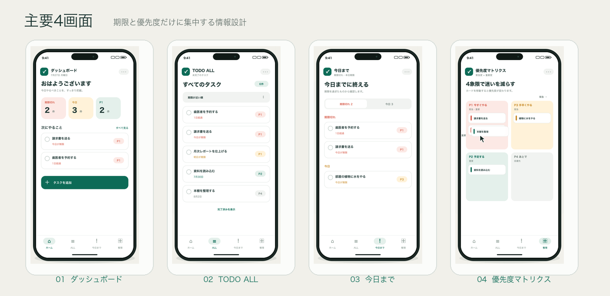

# 要件定義書

## わたしのタスク管理

**文書バージョン:** 0.1（要件整理版）  
**作成日:** 2026年7月27日  
**ステータス:** Draft／実装着手前  
**想定利用者:** アプリ所有者本人1名

> 期限と優先度だけに集中し、「今日、何から手を付けるか」を迷わないための個人専用タスク管理アプリ。

### 現行追加仕様（カテゴリ機能）

- タスク作成・編集時にカテゴリ（通常／プライベート）を選択できる。
- `プライベート`を選択したタスクだけを閲覧する専用画面（`/private`）を追加する。
- プライベートタスクも同じTasks表で管理し、TODO ALL、今日まで、マトリクス、今日の段取りなどの通常画面ではカテゴリに関係なく表示する。
- Google SheetsのP列に`category`を追加し、既存行の空欄は通常カテゴリとして扱う。

---

## 1. 文書の目的

本書は、個人専用タスク管理アプリ「わたしのタスク管理」の目的、対象範囲、画面、機能、データ、品質条件および受け入れ条件を定義する。実装方法の詳細は別紙「技術要件書」に定める。

## 2. 背景と課題

一般的なタスク管理サービスは、担当者、プロジェクト、タグ、コメント、添付ファイルなど多くの機能を持つ。一方、本アプリの利用者が日常的に確認したい情報は、主に「何をするか」「いつまでか」「どの程度優先するか」である。

本アプリでは機能を意図的に絞り、次の課題を解消する。

- 期限切れや本日期限のタスクを見落とす
- 緊急度と重要度が混在し、着手順を迷う
- 多機能な管理画面によって入力や確認が負担になる
- タスクデータを自分で確認・修正できる形で保管したい

## 3. プロダクト目標

### 3.1 主要目標

1. アプリを開いて数秒以内に、今日の状況を把握できる。
2. タスクを「期日」と「緊急度×重要度」で迷わず整理できる。
3. タスクの追加、完了、再開を少ない操作で行える。
4. データをGoogle Sheetsに保存し、利用者自身が直接確認できる。
5. 個人利用に必要な最低限の認証を、日常利用の負担を増やさず提供する。

### 3.2 成功の判断基準

- ダッシュボードで期限切れ・本日期限・今週期限・P1件数を確認できる。
- 必須項目を入力してタスクを登録できる。
- 未完了タスクを2種類の一覧と4象限マトリクスで確認できる。
- 完了したタスクが通常画面から消え、必要時に履歴から戻せる。
- 個人端末では初回認証後90日間、再入力なしで利用できる。
- Google Sheetsを正として、追加・編集・完了・復元・削除が反映される。

## 4. 利用条件と前提

| 項目 | 定義 |
|---|---|
| 利用人数 | 1名固定。複数ユーザー対応は行わない |
| 主な利用端末 | PCおよびスマートフォンのWebブラウザ |
| 言語 | 日本語 |
| タイムゾーン | Asia/Tokyo（日本時間） |
| 日付の扱い | 時刻を持たない日付単位 |
| データ保存先 | 非公開のGoogle Sheets |
| 稼働環境 | Vercel |
| 認証 | ユーザー名なしのパスフレーズ認証 |

## 5. 対象範囲

### 5.1 MVPに含めるもの

- パスフレーズによるロック解除とログアウト
- タスクの追加、表示、編集、完了、未完了への復元、削除
- ダッシュボード
- TODO ALL
- 今日まで
- 緊急度×重要度マトリクス
- Google Sheetsへのデータ保存
- タスクごとのコメントの追加・編集・表示
- PC／スマートフォン対応
- 読み込み、成功、失敗状態のフィードバック

### 5.2 MVPに含めないもの

- 複数ユーザー、共有、担当者、権限管理
- プロジェクト、タグ、サブタスク、添付ファイル
- コメントの履歴・複数コメント
- 繰り返しタスク
- メール、プッシュ、カレンダー等の通知
- 外部カレンダー連携
- 全文検索
- オフライン編集、ネイティブアプリ
- AIによる自動分類
- 利用分析や課金機能

## 6. 情報設計

主要画面は4画面とする。認証画面は主要画面数に含めない。

1. **ダッシュボード**
2. **TODO ALL**
3. **今日まで**
4. **優先度マトリクス**

PCでは左側ナビゲーションまたは上部ナビゲーション、スマートフォンでは下部ナビゲーションを基本とする。

## 7. 画面要件

### 7.1 認証画面

#### 目的

公開URLを第三者に知られた場合でも、タスクの閲覧・変更を防止する。

#### 表示要素

- アプリ名
- パスフレーズ入力欄
- 「ロックを解除」ボタン
- 認証失敗メッセージ

#### 動作

- 正しいパスフレーズで4画面へ進める。
- 認証状態は個人端末で90日間維持する。
- 未認証状態で主要画面やタスクAPIへアクセスした場合は認証画面へ戻す。
- ログアウト操作で認証状態を破棄する。
- 誤ったパスフレーズに対して、内部情報を含まない共通エラーを表示する。

### 7.2 ダッシュボード

#### 目的

アプリを開いた直後に、今日の状況と最初に着手すべきタスクを把握する。

#### 表示要素

- 今日の日付
- 期限切れ件数
- 今日が期限の件数
- 今週が期限の件数
- P1（緊急かつ重要）の件数
- 優先して着手するタスク一覧
- タスクのクイック追加

#### 動作

- 各件数カードを選択すると、対応するタスク一覧へ移動または絞り込む。
- 優先タスクは「期限切れ」「本日期限」「優先度」「期日」の順を考慮して表示する。
- クイック追加から、必要項目を入力してタスクを登録できる。
- データ更新後、件数と一覧を最新状態へ更新する。

### 7.3 TODO ALL

#### 目的

未完了タスクを漏れなく一覧で確認する。

#### 表示要素

- 未完了タスク件数
- タスク名
- 期日
- 優先度（P1〜P4）
- 完了操作
- 並べ替え
- 「完了済みを表示」切り替え

#### 動作

- 初期状態では未完了タスクのみ表示する。
- 期日順または優先度順に並べ替えられる。
- 完了済み表示を有効にすると、完了日を含む履歴を表示する。
- 完了済みタスクを未完了へ戻せる。
- タスクを選択すると編集できる。

### 7.4 今日まで

#### 目的

期限切れと本日期限の未完了タスクに集中する。

#### 表示条件

- `完了状態 = 未完了`
- `期日 <= 日本時間の今日`
- 削除されていないこと

#### 表示要素

- 「期限切れ」と「今日」の区分
- 各区分の件数
- タスク名、期日、超過日数、優先度
- 完了操作

#### 動作

- 期限切れを先に表示する。
- 期限切れ内では古い期日を先に表示する。
- 今日のタスクは優先度順、同一優先度では作成順に表示する。
- 完了すると一覧から取り除き、件数を更新する。

### 7.5 優先度マトリクス

#### 目的

緊急度と重要度を分けて判断し、タスクの優先度を視覚的に整理する。

| 優先度 | 緊急 | 重要 | 画面上の意味 |
|---|---:|---:|---|
| P1 | はい | はい | 今すぐやる |
| P2 | いいえ | はい | 予定する |
| P3 | はい | いいえ | 手早くやる |
| P4 | いいえ | いいえ | あとで |

#### 画面上の配置

重要度は左から右へ高くなり、緊急度は下から上へ高くなる。

| 位置 | 緊急度 | 重要度 | 優先度 |
|---|---|---|---|
| 右上 | 高い | 高い | P1 |
| 右下 | 低い | 高い | P2 |
| 左上 | 高い | 低い | P3 |
| 左下 | 低い | 低い | P4 |

#### 動作

- 未完了タスクを4象限に表示する。
- PCではドラッグ＆ドロップで象限を移動できる。
- タッチ端末およびキーボード操作では、移動先を選択する代替操作を提供する。
- 象限移動時に緊急度、重要度、表示優先度を同時に更新する。
- 優先度は緊急度と重要度から自動算出し、独立した手入力項目にはしない。

## 8. タスク機能要件

### 8.1 タスク項目

| 項目 | 必須 | 内容 |
|---|---:|---|
| タスク名 | 必須 | 1〜200文字 |
| コメント | 任意 | 0〜2000文字。タスクの補足情報 |
| 期日 | 必須 | YYYY-MM-DD形式の日付。時刻なし |
| 緊急度 | 必須 | はい／いいえ |
| 重要度 | 必須 | はい／いいえ |
| 優先度 | 自動 | P1〜P4。緊急度と重要度から算出 |
| 完了状態 | 自動 | 未完了／完了 |
| 完了日時 | 自動 | 完了操作時に記録 |
| 作成・更新日時 | 自動 | 監査および並べ替え用 |

### 8.2 タスク追加

- タスク名、コメント、期日、緊急度、重要度を入力する。
- コメントは空欄でも登録できる。
- 期日は空欄で登録できない。
- 登録成功後、成功通知を表示して該当画面を更新する。
- 同一名称のタスクは登録可能とする。

### 8.3 タスク編集

- タスク名、コメント、期日、緊急度、重要度を変更できる。
- 変更後の優先度は自動再計算する。
- 編集前に完了済みであっても、履歴表示から編集・復元できる。

### 8.4 完了と復元

- 完了操作で完了日時を記録する。
- 完了タスクは通常の4画面から非表示にする。
- TODO ALLの完了済み表示から未完了へ戻せる。
- 復元時は完了日時を空にし、現在の期日と優先度で各画面へ再表示する。

### 8.5 削除

- 削除前に確認を表示する。
- 誤削除やスプレッドシート上の履歴確認に備え、物理行削除ではなく削除状態として保存する。
- MVPでは削除済みタスクを画面から復元する機能は提供しない。必要時はGoogle Sheetsで修正できる。

## 9. 並べ替えと集計ルール

### 9.1 日付判定

- すべての「今日」はAsia/Tokyoで判定する。
- 期限切れは `期日 < 今日` とする。
- 本日期限は `期日 = 今日` とする。
- 今日までには期限切れと本日期限の両方を含める。
- 今週は月曜日から日曜日までとする。

### 9.2 優先して着手するタスク

ダッシュボードの候補順は次を基本とする。

1. 期限切れ
2. 本日期限
3. P1
4. 期日が近いもの
5. 同条件の場合は作成日時が古いもの

表示上限は5件を初期値とする。

## 10. 状態・フィードバック要件

- 初回読み込み中は、画面構造を保ったローディング表示を行う。
- 登録、更新、完了、復元、削除の成功時は短い通知を表示する。
- 通信失敗時は入力内容を保持し、再試行できる。
- Google Sheetsとの接続に失敗した場合は、データが未保存であることを明確に伝える。
- データが0件の場合は、次に行う操作が分かる空状態を表示する。
- 同じ操作の連打による重複登録を防止する。

## 11. 非機能要件

### 11.1 操作性

- 主要操作はマウス、タッチ、キーボードで実行できる。
- スマートフォン幅でも横スクロールなしで主要操作を完了できる。
- 色だけで優先度や状態を伝えず、P1〜P4等の文字を併記する。
- 誤操作しやすい削除には確認を設ける。

### 11.2 性能

- 通常の個人利用データ量において、初回表示は標準的な通信環境で概ね2秒以内を目標とする。
- 画面切り替えは保存済みデータを利用し、体感上即時に行う。
- Google Sheets APIへの読み書き回数を必要最小限にする。

### 11.3 可用性と復旧

- データの正本はGoogle Sheetsとする。
- アプリが利用できない場合でも、Google Sheetsからタスクを確認できる。
- スプレッドシートの列構造変更による破損を避けるため、ヘッダー行を保護する。

### 11.4 セキュリティ

- すべてのタスク画面とAPIを認証必須とする。
- パスフレーズおよびGoogle認証情報をブラウザへ配布しない。
- スプレッドシートを一般公開しない。
- 通信はHTTPSのみとする。
- ログへパスフレーズ、秘密鍵、タスク本文を出力しない。

## 12. 受け入れ条件

### 12.1 認証

- [ ] 未認証で主要画面へアクセスすると認証画面が表示される。
- [ ] 正しいパスフレーズでロックを解除できる。
- [ ] 個人端末で認証状態が90日間維持される。
- [ ] ログアウト後、タスク画面とAPIへアクセスできない。

### 12.2 タスク管理

- [ ] 期日を空欄にすると登録できない。
- [ ] 登録したタスクがGoogle Sheetsと対象画面へ反映される。
- [ ] 緊急度・重要度の組み合わせどおりP1〜P4が決まる。
- [ ] 編集内容が再読み込み後も保持される。
- [ ] 完了タスクが通常画面から消える。
- [ ] 完了済み表示から未完了へ戻せる。
- [ ] 削除前に確認が表示され、削除後は通常画面に表示されない。

### 12.3 4画面

- [ ] ダッシュボードの各件数が一覧内容と一致する。
- [ ] TODO ALLに未完了タスクがすべて表示される。
- [ ] 今日までに、期限が今日以前の未完了タスクだけが表示される。
- [ ] マトリクス移動によって緊急度・重要度・優先度が更新される。
- [ ] PCとスマートフォンの両方で主要操作を完了できる。

## 13. 決定済み事項

- 利用者は本人1名のみ。
- 主要画面は4画面。
- 期日は必須で、時刻は扱わない。
- 優先度は緊急度×重要度から自動算出する。
- 認証はパスフレーズ方式とし、認証状態を90日間維持する。
- 完了タスクは通常非表示とし、TODO ALL内から確認・復元できる。
- データ保存先はGoogle Sheets、稼働先はVercelとする。
- Next.jsを利用する想定とする。

## 14. 実装前に最終決定する事項

| 決定事項 | 現在の状態 | 決定内容 |
|---|---|---|
| 正式なアプリ名 | 仮称あり | わたしのタスク管理 |
| 本番URL・独自ドメイン | 未決定 |  |
| パスフレーズの初期設定 | 未決定 | 文書には値を記載しない |
| Google Sheets作成先 | 未決定 | Googleアカウントを指定する |
| P1〜P4の色・最終文言 | モック案あり | 実装画面で最終確認する |

### 14.1 実装着手条件

- [ ] 上記の未決定事項が実装担当へ共有されている。
- [ ] 技術要件書の構成とセキュリティ方針が承認されている。
- [ ] 開発・Preview用のGoogle Sheetsを用意できる。
- [ ] 本番用のVercelプロジェクトとGoogle Cloudプロジェクトの所有者が決まっている。

要件変更が発生した場合は、本書のバージョンを更新し、変更理由と影響する画面・API・データ列を記録してから実装へ反映する。
